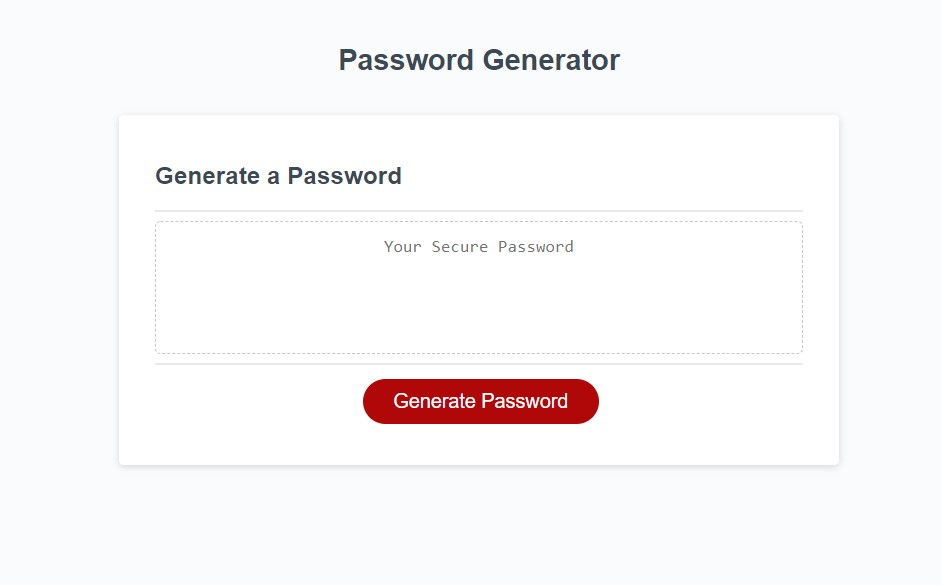

# password-generator
Week 3 - Modifying starter code to create an application that enables users to generate random passwords based on criteria that they’ve selected. The password can include special characters.

Acceptable Criteria DESCRIPTION:

+the user is presented with a series of prompts for password criteria when the button to generate a password is clicked on

+the user can select which criteria to include in the password when prompted for password criteria

+the user can choose a length of at least 8 characters and no more than 128 characters when prompted for the length of the password

+the user can choose lowercase, uppercase, numeric, and/or special characters when promtped for character types to include in the password

+the user's input should be validated and at least one character type should be selected when the user answers each prompt

+a password is generated that matches the selected criteria when all prompts are answered

+the password is either displayed in an alert or written to the page when the password is generated

NOTES/CHALLENGES:

+line 14 (JS) - "generatePassword" is not yet defined in the starter code

SCREENSHOT:

LINK:

+deployed application - https://eloghub.github.io/password-generator/